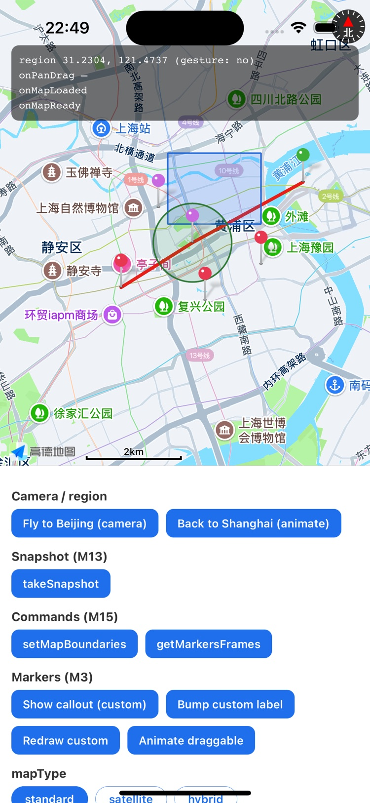
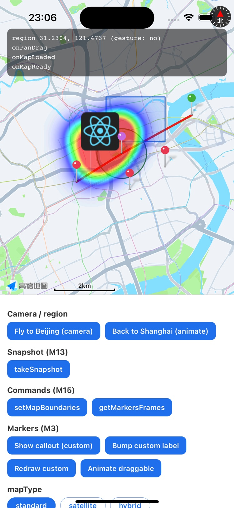

<div align="center">

# 🗺️ react-native-cn-maps

### `react-native-maps`-compatible map components for China

AMap / 高德 on **iOS & Android**, built for the React Native **New Architecture (Fabric)**.
Most code ports over by changing a single import.

<p>
  <a href="https://www.npmjs.com/package/react-native-cn-maps"></a>
  <a href="https://www.npmjs.com/package/react-native-cn-maps"></a>
  
  
  <a href="./LICENSE"></a>
</p>

<p>
  
  &nbsp;&nbsp;
  
</p>

<sub>The bundled <code>example/</code> app on the iOS simulator — markers, polyline, polygon, circle, image overlay & heatmap.</sub>

</div>

---

## ✨ Highlights

- 🔁 **Drop-in `react-native-maps` API** — `MapView`, `Marker`, `Callout`, `Polyline`, `Polygon`, `Circle`, `Overlay`, `UrlTile`, `LocalTile`, `WMSTile`, `Heatmap`, `Geojson`.
- 📱 **iOS & Android**, verified on device + simulator.
- 🧭 **Coordinate systems** — `gcj02` / `wgs84` / `bd09`, converted in JS so the native layer always speaks GCJ-02.
- ⚡ **New Architecture only** — Fabric components + TurboModule, no bridge.
- 🔒 **Privacy-first** — never auto-agrees; the host app declares PIPL consent explicitly.
- 🇨🇳 **China providers** — AMap today; Baidu / Tencent planned (API shape already reserved).

## 📦 Installation

```sh
npm install react-native-cn-maps
# or
yarn add react-native-cn-maps
```

Requires React Native with the New Architecture enabled.

## 🚀 Quick start

```tsx
import MapView, { Marker } from 'react-native-cn-maps';

export default function Map() {
  return (
    <MapView
      provider="amap"
      coordinateSystem="gcj02"
      style={{ flex: 1 }}
      initialRegion={{
        latitude: 31.2304,
        longitude: 121.4737,
        latitudeDelta: 0.05,
        longitudeDelta: 0.05,
      }}
    >
      <Marker
        coordinate={{ latitude: 31.2304, longitude: 121.4737 }}
        title="Shanghai"
      />
    </MapView>
  );
}
```

> ⚠️ The map renders **blank** until you declare privacy consent — see
> [Privacy compliance](#-privacy-compliance-required) below.

## 🧩 Components & API

| Component | Notes |
|-----------|-------|
| `MapView` | `provider`, `coordinateSystem`, controlled `region` / `camera`, full prop & event surface |
| `Marker` | default / colored / `image` / custom React view (rasterized) / draggable |
| `Callout` | custom info-window bubbles |
| `Polyline` | gradient `strokeColors`, `lineCap` / `lineJoin` / `miterLimit`, tappable |
| `Polygon` | with `holes` |
| `Circle` | center / radius / stroke / fill |
| `Overlay` | image ground overlay (`bounds` + `bearing` + `opacity`) |
| `UrlTile` · `LocalTile` · `WMSTile` | custom raster tile layers |
| `Heatmap` | weighted points + gradient |
| `Geojson` | pure-JS GeoJSON renderer (point / line / polygon, incl. holes) |

**MapView ref commands:** `animateToRegion`, `animateCamera` / `setCamera`, `getCamera`, `getMapBoundaries`, `pointForCoordinate` / `coordinateForPoint`, `fitToCoordinates` / `fitToElements` / `fitToSuppliedMarkers`, `takeSnapshot`, `setMapBoundaries`, `getMarkersFrames`.

📖 Full comparison: [feature parity with `react-native-maps`](docs/RNM_PARITY_PLAN.md) · [migration guide](docs/MIGRATION_FROM_RN_MAPS.md)

## ⚙️ Native setup

### Android

Add your AMap Android key to the host app manifest:

```xml
<application>
  <meta-data
    android:name="com.amap.api.v2.apikey"
    android:value="YOUR_AMAP_ANDROID_KEY" />
</application>
```

<details>
<summary>SDK version override &amp; <code>&lt;Heatmap&gt;</code> Jetifier note</summary>

The library pins a known-good AMap SDK version. To track a newer one, override it
from the host Gradle project:

```gradle
ext.amapSdkVersion = "11.2.000_loc11.2.000_sea9.8.0"
```

If you use `<Heatmap>`, enable Jetifier in `android/gradle.properties` — AMap's
heatmap component still references the legacy `android.support.v4`
(`LongSparseArray`), which throws `ClassNotFoundException` on AndroidX otherwise:

```properties
android.enableJetifier=true
```

</details>

### iOS

Set the AMap iOS key before the React Native surface starts (e.g. in `AppDelegate`):

```swift
import AMapFoundationKit

AMapServices.shared().apiKey = "YOUR_AMAP_IOS_KEY"
```

The podspec depends on `AMap3DMap` (which pulls in `AMapFoundation`), so just run
`pod install`.

<details>
<summary>Running on the iOS Simulator (Apple Silicon)</summary>

AMap's `MAMapKit` / `AMapFoundation` fat frameworks ship an **arm64 slice for
device** and an **x86_64 slice for simulator** — there is **no arm64 simulator
slice**. On Apple Silicon the simulator app must build as x86_64 (it runs under
Rosetta). AMap's podspec already excludes arm64 for the app target; mirror it on
every pod target, or the pods build arm64 and fail to link. Add to your
`Podfile`'s `post_install`:

```ruby
post_install do |installer|
  # ... react_native_post_install(...) ...
  installer.pods_project.targets.each do |t|
    t.build_configurations.each do |bc|
      bc.build_settings['EXCLUDED_ARCHS[sdk=iphonesimulator*]'] = 'arm64'
    end
  end
end
```

Real-device (arm64) builds are unaffected — this is simulator-only.

</details>

## 🔒 Privacy compliance (required)

China map SDKs won't initialize until the host app declares privacy compliance —
until then the map renders **blank** (AMap logs `555570`). Per PIPL and app-store
review, show your privacy policy and obtain consent **before** initializing the
map. **This library never auto-agrees on your behalf.**

After the user accepts, call `setPrivacyConsent` **before mounting any `<MapView>`**:

```tsx
import { setPrivacyConsent } from 'react-native-cn-maps';

// once, at app startup, after the user taps "Agree" in your dialog:
setPrivacyConsent({ agreed: true, contains: true, shown: true });
```

| param | meaning |
|-------|---------|
| `agreed` | the user agreed to the privacy policy |
| `contains` | your privacy policy includes the map SDK's terms |
| `shown` | the privacy policy was shown to the user |

Implemented on **both platforms** (iOS maps to AMap's `+[MAMapView updatePrivacyShow:privacyInfo:]` / `+[MAMapView updatePrivacyAgree:]`).

## 🚧 Not supported

- `provider="google"` — this library targets China providers
- Baidu / Tencent providers — planned (`coordinateSystem="bd09"` already wired in the JS layer)
- Web

## 🤝 Contributing

- [Development workflow](CONTRIBUTING.md#development-workflow)
- [Sending a pull request](CONTRIBUTING.md#sending-a-pull-request)
- [Code of conduct](CODE_OF_CONDUCT.md)

## 📄 License

[MIT](LICENSE)
