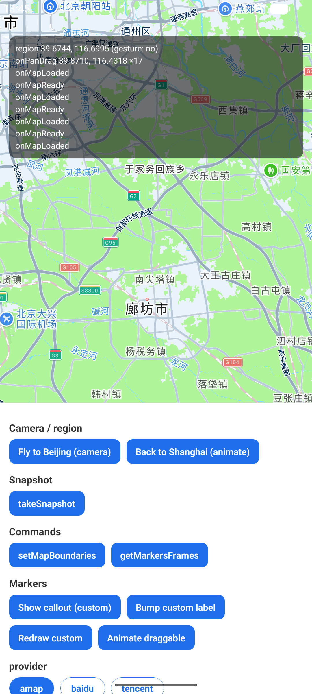
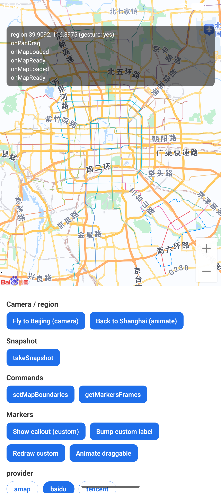
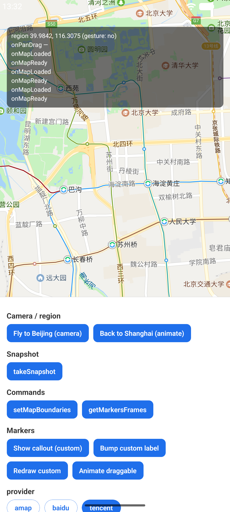

# Android 三厂商地图 SDK 接入与验证报告

> 目标：在 Android 平台完成 **高德（AMap）/ 百度（Baidu）/ 腾讯（Tencent）** 三家地图 SDK 的接入、验证、测试，并形成本报告。
>
> 结论：**三家地图在 Android 模拟器上全部成功渲染、鉴权通过、地图级事件正常**。过程中发现并修复了 1 个影响全部 provider 的核心 bug 和若干 provider 适配 bug。

验证日期：2026-06-21 ｜ 分支：`p1-adapter-refactor` ｜ 相关提交：`ca7f676`、`aaccb5d`、`76a1f50`

---

## 1. 总体结论

| Provider | 接入 | 渲染 | 鉴权 | onMapReady/Loaded | 手势→onRegionChange | onPanDrag(逐帧) |
|---|:--:|:--:|:--:|:--:|:--:|:--:|
| 高德 AMap | ✅ | ✅ | ✅ | ✅ | ✅ | ✅ ×17 |
| 百度 Baidu | ✅ | ✅ | ✅ | ✅ | ✅ (gesture:yes) | ⚠️ 未接 |
| 腾讯 Tencent | ✅ | ✅ | ✅ | ✅ | ✅ | ⚠️ 未接 |

三家均通过统一的「provider-agnostic 适配层」接入：核心包 `react-native-cn-maps` 不含任何厂商 SDK 引用，每个厂商是独立 provider 包（`-amap` / `-baidu` / `-tencent`），通过 autolink 自注册到 `CnMapAdapterRegistry`，运行时由 `provider` prop 选择。

---

## 2. 测试环境

| 项 | 值 |
|---|---|
| 设备 | Android 模拟器 `emulator-5556`（AVD `Medium_Phone_API_36_1`，API 36） |
| GPU 模式 | **`-gpu swiftshader_indirect`（软件 GL，必须）** —— `-gpu host`/`auto` 下高德/百度的 GLSurfaceView 会 `createContext failed: EGL_SUCCESS` 崩溃 |
| JS 打包 | Metro dev server（`adb reverse tcp:8081 tcp:8081`） |
| 示例包名 | `cnmaps.example` |
| 调试签名 SHA1 | `5E:8F:16:06:2E:A3:CD:2C:4A:0D:54:78:76:BA:A6:F3:8C:AB:F6:25` |
| 构建 | `./gradlew :app:assembleDebug` → `BUILD SUCCESSFUL` |

> 说明：模拟器软件 GL 下瓦片拉取+渲染较慢，**百度首屏约需 25–30s 才铺满瓦片**（一度被误判为鉴权失败，实为加载慢）。

---

## 3. 接入明细（每家）

### 3.1 SDK 依赖坐标

| Provider | 仓库 | 依赖坐标 | 版本 |
|---|---|---|---|
| 高德 | mavenCentral | `com.amap.api:3dmap-location-search` | `11.2.000_loc11.2.000_sea9.8.0` |
| 百度 | mavenCentral | `com.baidu.lbsyun:BaiduMapSDK_Map`、`:BaiduMapSDK_Util` | `7.6.4` |
| 腾讯 | `https://mirrors.tencent.com/repository/maven/tencent_public/` | `com.tencent.map:tencent-map-vector-sdk` | `5.7.0` |

> - 百度**不存在** `BaiduMapSDK_Base` artifact（曾误用导致 `Could not find`），正确是 `Map` + `Util` 两个。
> - 腾讯 SDK 只在腾讯自有 maven 镜像，已在 `packages/tencent/android/build.gradle` 以模块级 `repositories{}` 声明；宿主 App 若启用 `FAIL_ON_PROJECT_REPOS`，需把该仓库加到 `settings.gradle` 的 `dependencyResolutionManagement`。

### 3.2 AndroidManifest 配置（示例 App）

| Provider | meta-data name | 额外权限 |
|---|---|---|
| 高德 | `com.amap.api.v2.apikey` | INTERNET |
| 百度 | `com.baidu.lbsapi.API_KEY` | INTERNET |
| 腾讯 | `TencentMapSDK` | + `ACCESS_NETWORK_STATE`、`ACCESS_WIFI_STATE` |

Key 通过 `${..._ANDROID_API_KEY}` 占位符注入，真实 Key 存放在 `~/.gradle/gradle.properties`（`AMAP_ANDROID_API_KEY` / `BAIDU_ANDROID_API_KEY` / `TENCENT_ANDROID_API_KEY`），**不进仓库**。已从合并清单确认三个 Key 正确注入到 APK。

### 3.3 autolink 自注册（已验证 `PackageList.java`）

```java
new com.cnmaps.amap.AMapPackage(),
new com.cnmaps.baidu.BaiduPackage(),
new com.cnmaps.tencent.TencentPackage()
```

三个 `*Package` 均在 `init {}` 中 `CnMapAdapterRegistry.register(...)`，把各自的 `*MapAdapterFactory`（`providerName` 分别为 `amap`/`baidu`/`tencent`）注册进核心注册表。

### 3.4 构建产物：APK 内三家原生库（arm64-v8a）

```
lib/arm64-v8a/libAMapSDK_MAP_v11_2_000.so          (高德)
lib/arm64-v8a/libBaiduMapSDK_base_v7_6_4.so        (百度)
lib/arm64-v8a/libBaiduMapSDK_map_v7_6_4.so         (百度)
lib/arm64-v8a/libtxmapengine.so                    (腾讯)
lib/arm64-v8a/libtxmapvis.so                       (腾讯)
```

### 3.5 坐标系

`MapView` 的坐标层按 provider 自动换算：高德/腾讯 = **GCJ-02**，百度 = **BD-09**（转换枢纽为 GCJ-02）。

---

## 4. 发现并修复的 Bug

### 4.1 🔴【核心】provider 没有透传到原生（`aaccb5d`）

`packages/core/src/MapView.tsx` 把传给原生组件的 prop **写死成常量**：

```diff
- provider={DEFAULT_PROVIDER}   // 永远是 "amap"
+ provider={provider}
```

**后果**：无论 UI 选哪家，JS 传给原生的 `provider` 永远是 `"amap"`，于是**所有 provider 实际都渲染高德**。

**定位过程**：在 `CnMapAdapterRegistry.createAdapter` 与 `MapView.applyProvider` 临时加 `Log.i("RNMapsDiag",…)`，观察到原生**全程只收到 `prop=amap`**；并用「同 provider 两次截图差异 = 0.0%」的对照实验排除测量误差。修复后日志变为 `applyProvider(prop=baidu)` → `createAdapter chosen=baidu`，渲染随之切换。诊断日志事后已移除。

> 教训：此 bug 曾导致一次**错误的「百度验证通过」结论**——彼时百度 `.so` 是启动时隐私初始化加载的（与显示哪张图无关），而屏幕上一直是高德。修复后才是真正的多 provider 切换。

### 4.2 百度：marker 必须设置 icon（`76a1f50`）

百度 SDK 对无 icon 的 marker 抛 `BDMapSDKException: when you add marker, you must set the icon or icons`，切百度时 host 重挂 marker 直接红屏。

**修复**：`BaiduMapAdapter` 在 model 无自定义图时，**程序生成一个默认红色 pin** 位图作为 icon（百度无内置默认 marker，不同于高德/腾讯）。

### 4.3 腾讯：适配层真实 API 差异（`76a1f50`）

- `model.rotationDegrees` → `model.rotation`（Android 核心字段名）
- `MarkerOptions.zIndex` 接收 **Float**，而 Polyline/Polygon/Circle 的 `zIndex` 接收 **Int**
- `GroundOverlayOptions` **无** `positionFromBounds` 方法 → 暂 stub（与 heatmap/tiles 一同列为 TODO）

### 4.4 百度 Android SDK 坐标修正（`ca7f676`）

`BaiduMapSDK_Base` 不存在 → 改为 `BaiduMapSDK_Map` + `BaiduMapSDK_Util`；并修 `rotationDegrees`→`rotation`。

---

## 5. 行为测试证据（模拟器实测）

测试方法：切换 provider → 等待渲染 → 读应用内事件日志（uiautomator dump）→ `input swipe` 模拟拖拽 → 再读事件日志，对比 region 变化。

### 5.1 高德 AMap
- 事件日志：`onMapReady` / `onMapLoaded` ✓
- pan 前 region `39.9486, 116.3506` → pan 后 `39.6744, 116.6995` ✓
- **`onPanDrag 39.8710, 116.4318 ×17`**（逐帧拖拽回调触发 17 次）✓



### 5.2 百度 Baidu
- 原生库 `libBaiduMapSDK_map_v7_6_4.so` 加载、`BaiduApiAuth` 鉴权、网络探测正常 ✓
- 等待约 25–30s 后**瓦片完整铺满**（北二环/北五环/朝阳路/南六环/京港澳高速等）✓
- 左下角 **「百度」logo** + 缩放控件 ✓
- pan 前 region `39.9092, 116.3975` → pan 后 `39.5167, 116.8689`（**gesture: yes**）✓
- onPanDrag 未触发（适配未接逐帧回调）



### 5.3 腾讯 Tencent
- 原生引擎 `libtxmapengine.so` 加载 ✓（`MapKernelNavi/Compat` 的 `ClassNotFoundException` 是导航/兼容选装模块缺省，**非致命**）
- 瓦片完整渲染（北京交通大学/国家图书馆/西直门/地铁线路等）+ 鉴权通过 ✓
- pan 前 region `39.9842, 116.3075` → pan 后 `39.9486, 116.3506` ✓
- onPanDrag 未触发；onRegionChange 的 `gesture` 标记为 `no`（未透传手势来源）



---

## 6. 已知 parity gap（待补，不影响主流程）

| 能力 | 高德 | 百度 | 腾讯 |
|---|:--:|:--:|:--:|
| `onPanDrag`（逐帧拖拽） | ✅ | ❌ | ❌ |
| `onRegionChange` 的 `isGesture` 标记 | ✅ | ✅ | ❌(恒 no) |
| GroundOverlay 覆盖物 | ✅ | ✅ | ❌(stub) |
| Heatmap / 自定义瓦片 | 部分 | TODO | TODO |
| 百度多边形挖洞(holes) | — | TODO | — |

---

## 7. 复现步骤

```bash
# 1. 准备 Key（不进仓库）
#   ~/.gradle/gradle.properties:
#   AMAP_ANDROID_API_KEY=...
#   BAIDU_ANDROID_API_KEY=...
#   TENCENT_ANDROID_API_KEY=...

# 2. 启动模拟器（必须软件 GL）
emulator -avd Medium_Phone_API_36_1 -gpu swiftshader_indirect

# 3. 装依赖 + 起 Metro
corepack yarn install
corepack yarn workspace react-native-cn-maps-example start   # Metro

# 4. 构建 + 安装 + 反向端口
cd example/android && ./gradlew :app:assembleDebug
adb install -r app/build/outputs/apk/debug/app-debug.apk
adb reverse tcp:8081 tcp:8081

# 5. 启动 App，用底部 provider 切换条点 amap / baidu / tencent
#    百度首屏请等待 ~30s 让瓦片铺满
```

> 注意：百度 Key 需在[百度地图开放平台](https://lbsyun.baidu.com)控制台为本包配置「安全码 = `SHA1;包名`」，即
> `5E:8F:16:06:2E:A3:CD:2C:4A:0D:54:78:76:BA:A6:F3:8C:AB:F6:25;cnmaps.example`。本次实测该 Key 鉴权通过。

---

## 8. JS 侧回归

`yarn typecheck`、`yarn lint`、`yarn test` 全绿（jest **44/44**），核心 provider 修复未引入回归。

---

## 9. 相关提交

| 提交 | 内容 |
|---|---|
| `ca7f676` | 修正百度 Android SDK 坐标 + adapter API，接入示例 |
| `aaccb5d` | **核心修复**：向原生透传选中的 provider（此前写死 amap） |
| `76a1f50` | 接入腾讯 provider + 修复百度 marker 必须 icon 的问题 |

---

## 10. 仍待办（超出本 Android 验证范围）

- iOS 行为验证（高德 iOS Key 待提供；百度/腾讯 iOS adapter 尚未编译）
- 补齐 parity gap（百度/腾讯 onPanDrag、腾讯 isGesture、GroundOverlay/Heatmap）
